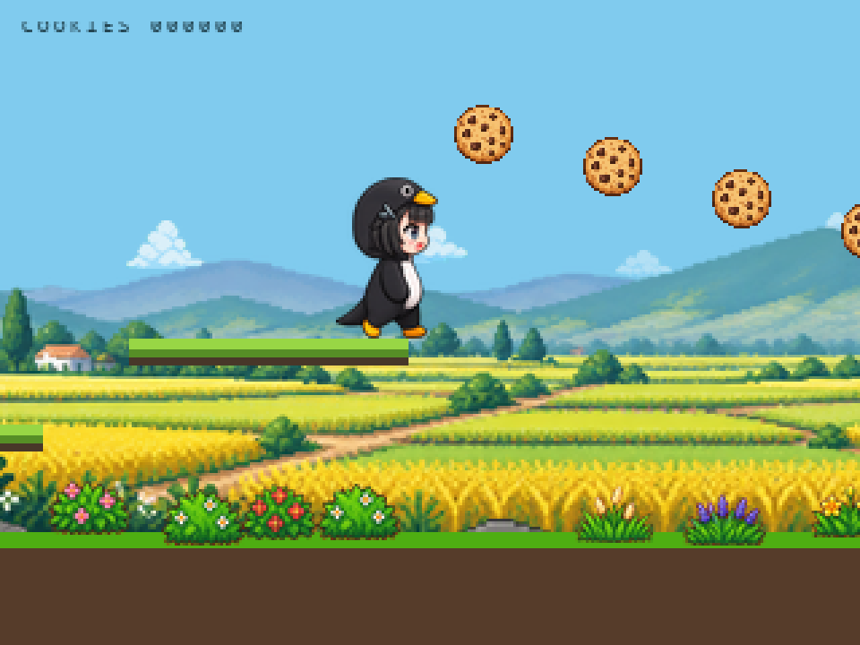

# Gugugaga_jump

RP2040 + Arm-2D 横版企鹅跳跃与曲奇收集游戏，沿用本仓库的独立 Keil demo 结构。



## 玩法

- 左右倾斜设备加速或减速，放平后保持当前巡航速度。
- 短按电源键跳跃；释放后才能再次起跳。
- 主动起跳后持续按住，越过顶点进入滑翔；释放后恢复普通下落。
- 收集曲奇计数，2 秒内连续收集可续连；从第二枚显示像素 Combo 提示。
- 随机平台路线中包含登高后沿滑翔轨迹排列的六枚曲奇串，鼓励滑翔连续收集。
- 路线包含长平台、两级登高、升降平台、三级阶梯和分离低平台等结构；八套模板有
  72 种尺寸/高度组合，随机选择时排除最近两段使用过的结构家族。

## 硬件

适配 Arm2D-Pi / Crystal Mouse 的 RP2040 板级连接：320×240 ST7789 并行屏、QMI8658 IMU，
跳跃使用 `POWER_UP_CHECK_PIN`（GPIO9，低有效）。运行时系统时钟为 250 MHz。
具体屏幕、IMU 引脚和电源保持配置见 `platform/`、`deivers/` 和 `application/bsp_cfg.h`。

按键信号修复后使用 1 ms 采样、6 ms 按下消抖、12 ms 松手消抖，已移除旧的 250 ms 电平中断兼容。
短按事件跨画面帧锁存，快速松开再按可重新起跳；长按落地不会自动再跳。
滑翔保持约 300 ms 长按与越过顶点的门槛，保留 100 ms 跳跃预输入及 80 ms 离台宽限。

## 编译

打开 [`project/mdk/template.uvprojx`](project/mdk/template.uvprojx)，选择 **AC6-flash**。
本次使用 Arm Compiler 6.19 验证；安装以下 CMSIS Packs：

| Pack | 验证版本 |
| --- | --- |
| ARM::Arm-2D | 1.2.6-dev317+g40b2a62 |
| RaspberryPi::RP2xxx_DFP | 0.9.5 |
| ARM::CMSIS | 6.1.0 |
| ARM::CMSIS-DSP | 1.14.2 |
| ARM::CMSIS-Compiler | 2.1.0 |
| ARM::CMSIS-View | 1.2.0 |
| GorgonMeducer::perf_counter | 2.5.5-dev10+gb32a99a |

Pico SDK、Arm-2D 和 perf_counter 由 Pack 提供；游戏不依赖其他 demo 目录，不需要 SD 卡素材。
本地自定义 RTE 配置、显示驱动、游戏素材和 TinyUSB/FatFs 等源码已包含。

PowerShell 命令行示例（在 `project/mdk` 下执行，按安装位置调整 UV4 路径）：

```powershell
Start-Process -FilePath 'D:\keil538\UV4\UV4.exe' `
  -ArgumentList '-b .\template.uvprojx -t AC6-flash -j0 -o .\Objects\build.log' `
  -WindowStyle Hidden -Wait
```

输出为 `project/mdk/Objects/template.axf` 和 `project/mdk/template.uf2`。

## 烧录

下载 [`firmware/Gugugaga_jump.uf2`](firmware/Gugugaga_jump.uf2)，按住 BOOTSEL 连接 USB，
将 UF2 复制到 RP2040 的 `RPI-RP2` 盘。烧录键 BOOTSEL 与游戏跳跃的 GPIO9 电源键不同。

## 主要代码

- `application/arm_2d_scene_platformer.c/.h`：场景、分层绘制、局部刷新和像素 Combo。
- `application/platformer_game.c/.h`：固定步长物理、随机平台、收集、滑翔和连击。
- `application/platformer_speed_control.h`：倾斜加减速与水平巡航。
- `application/power_key_service.c/.h`：按键采样与滤波。
- `application/arm_2d_asset_platformer_*.c`：编译进 Flash 的 RGB565/A8 素材。
- `assets/platformer/`：对应 PNG 图集与预览；PNG 不需要单独烧录。
- `tools/tests/`：主机物理、连击、路线与场景裁剪检查。

在 demo 根目录运行主机检查（需要 GCC、Python、Pillow）：

```powershell
New-Item -ItemType Directory -Force _compile_check | Out-Null
gcc -std=c11 -O2 -Wall -Wextra -Werror tools/tests/test_platformer_glide_route.c -o _compile_check/glide_route.exe
./_compile_check/glide_route.exe
python tools/tests/test_platformer_scene.py
```

曲奇、企鹅动画及 Combo 使用生成式位图并经尺寸校准转换。代码中的上游版权与许可声明保留，
TinyUSB 许可见 `lib/tinyusb/LICENSE`，其余依赖遵循各自随附或 Pack 中的许可。

## 验证

独立目录全量编译及主机检查完成；详见 [`VALIDATION.md`](VALIDATION.md)。
软件模拟不能替代实际屏幕帧率、按键电路和操作手感测试。
